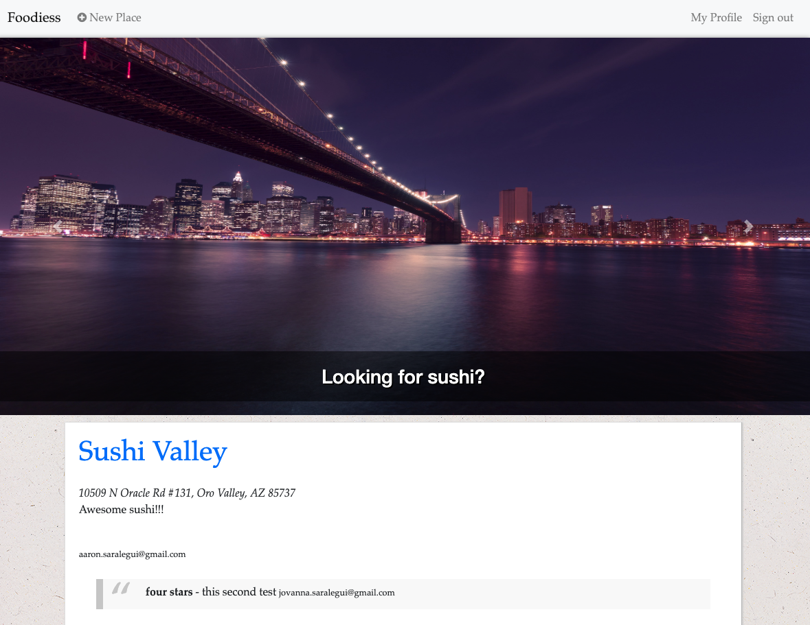

# Foodiess

A Yelp clone that integrates with the Google Maps API and includes features like user 
comments, star ratings, image uploading, and user authentication.

[link](https://foodiess-saralegui.herokuapp.com)

# Features: 

Uses the Google Map API.

Allows users to add restaurants, upload photos, add comments, and rate restaurants using a 5 star rating system.

Image storage and delivery utilizes Amazon's S3 Web Services.

Devise is used for user authentication and sign-in forms.

Incorporates a simple search feature.

CSS styling is done with Twitter Bootstrap.

Postgresql is used for the database.

